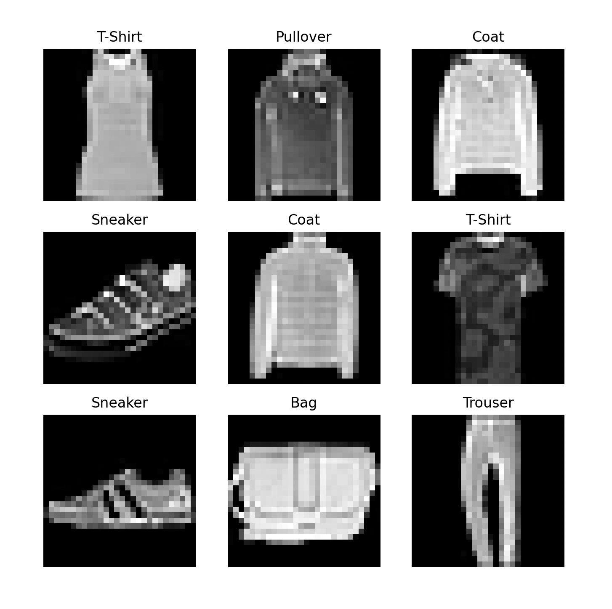

# Image classification on the Fashion MNIST dataset

60,000 training examples and 10,000 test examples

Highest achieved accuracy: 89.5%, avg loss 0.402

Some of the neural nets:

Feedforward neural net which achieved 90% accuracy on a binary image fashionMNIST dataset. 

Convolutional neural net which consists of two parts: convolutional net and a fully connected net. In simple terms: the convolutional net extracts features, while the fully connected network makes predictions based on the extracted features.

### Locally-saved weights

Weights can also be saved locally, instead of only in memory. Note: you can only load weights if state dict (weights) is  initialized and/or trained. 

